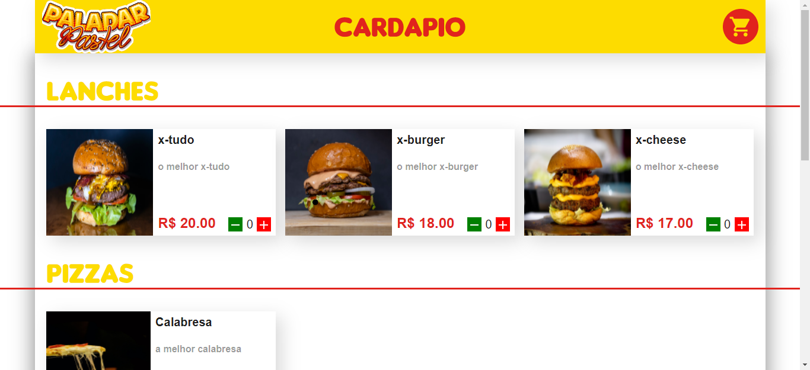

# Repo-paladar
    

>Site criado no intuito de por em praticas conhecimentos adquiridos em diversos cursos da [**Alura**](https://cursos.alura.com.br/user/donathan-queiros/fullCertificate/2ef6c139004fb676607779e28fcff683) entre outros cursos.
**Designer criado por mim - FIGMA** -  [Aqui](https://www.figma.com/file/RMWIGHAC7pRCKEs3usrSRc/Untitled)
**Acesse Aqui** - [Live demo](https://paladar-demo.netlify.app/)\
**Acesse Aqui Admistrativa**  - [Live demo](https://paladar-demo.netlify.app/adm)

### Ajustes e melhorias

O projeto ainda está em desenvolvimento e as próximas atualizações serão voltadas nas seguintes tarefas:

- [x] Criação do back-end - API e Models
- [x] Criação do front-end - components
- [x] Comunicação do front e back - CRUD
- [ ] Adicionar open API - Swagger - back
- [ ] Adicionar autenticação API - JWT 
